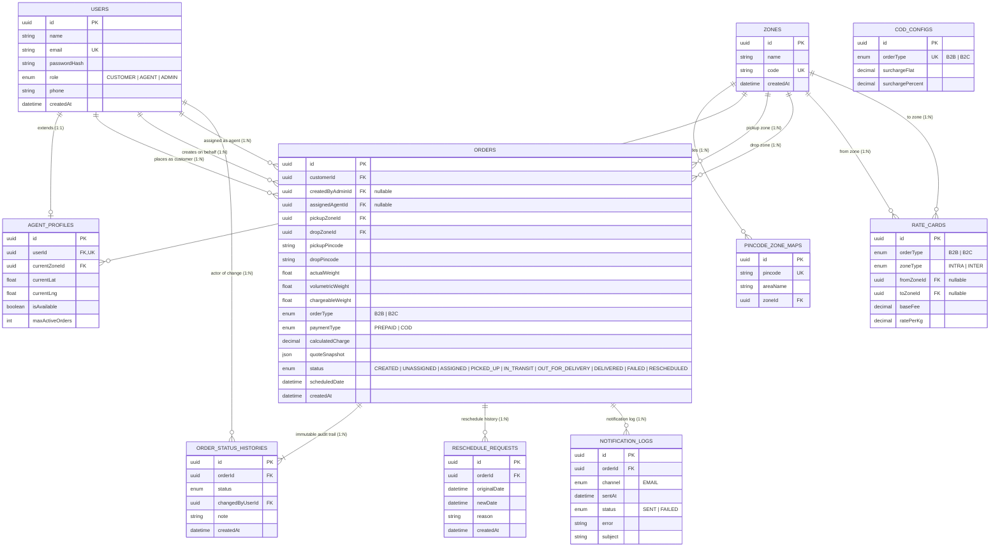

# Last-Mile Delivery Tracker — Architectural Master Plan (AAPLAN.md)

This document establishes the architecture source of truth, tech stack, database schema, rate engine algorithms, state machine lifecycle, and phase-by-phase execution plan for the **Last-Mile Delivery Tracker** platform.

---

## 1. Executive Summary & Objective

The **Last-Mile Delivery Tracker** is an end-to-end logistics platform serving three distinct user roles:
1. **Customer**: Registers, requests real-time quotes based on package dimensions/weight/pincodes, confirms orders upon reviewing itemized pricing breakdowns, tracks live order status across an immutable timeline, and initiates reschedules if delivery fails.
2. **Delivery Agent**: Admin-provisioned, views active assigned runs, updates delivery progress step-by-step (*Picked Up* → *In Transit* → *Out for Delivery* → *Delivered* or *Failed*), and toggles duty availability.
3. **Admin**: Manages operational zones and pincode-to-zone mappings, configures dynamic rate cards (B2B/B2C, intra/inter-zone) and COD surcharge rules, performs manual or auto-agent dispatch, monitors unassigned bottlenecks with proactive alerts, and exercises administrative status overrides with complete audit logging.

**Core Tenet**: Zero hardcoding of pricing or operational topology. All rates, surcharges, zone assignments, and capacity thresholds are database-driven and admin-configurable.

---

## 2. System Architecture

```text
                               ┌─────────────────────────────────────────────────────────────┐
                               │                    FRONTEND (React + Vite)                  │
                               │  - Role Portals: Customer, Agent, Admin                     │
                               │  - Live Rate Quote Preview & Itemized Breakdown             │
                               │  - Immutable Timeline & Reschedule Workflow                 │
                               │  - Admin Operations: Zones, Rates, COD & Dispatch Alerts    │
                               └──────────────────────────────┬──────────────────────────────┘
                                                              │
                                                              │ HTTPS (REST API + JWT Bearer Auth)
                                                              ▼
                               ┌─────────────────────────────────────────────────────────────┐
                               │                BACKEND (Node.js + Express + TS)             │
                               │                                                             │
                               │  ┌───────────────────────────────────────────────────────┐  │
                               │  │               Security & Auth Layer                   │  │
                               │  │  - JWT Verification (requireAuth)                     │  │
                               │  │  - Role-Based Access Control (requireRole)            │  │
                               │  │  - Resource Ownership Validation (canAccessOrder)     │  │
                               │  └───────────────────────────┬───────────────────────────┘  │
                               │                              │                              │
                               │  ┌───────────────────────────▼───────────────────────────┐  │
                               │  │                Domain Service Modules                 │  │
                               │  │                                                       │  │
                               │  │  1. RateEngine (rateEngine.ts)                        │  │
                               │  │     - Pincode-to-Zone Detection                       │  │
                               │  │     - Volumetric & Chargeable Weight (L×B×H / 5000)   │  │
                               │  │     - RateCard Lookup (B2B/B2C, Intra/Inter)          │  │
                               │  │     - COD Surcharge Calculation                       │  │
                               │  │                                                       │  │
                               │  │  2. AssignmentService (assignmentService.ts)          │  │
                               │  │     - Pickup Zone Agent Discovery                     │  │
                               │  │     - Capacity & Availability Filtering               │  │
                               │  │     - Load-Balancing Dispatch (Fewest Active Jobs)    │  │
                               │  │     - Unassigned Fallback & Alert Trigger             │  │
                               │  │                                                       │  │
                               │  │  3. OrderStatusService (orderStatusService.ts)        │  │
                               │  │     - Strict Agent State Machine Validation           │  │
                               │  │     - Append-Only OrderStatusHistory Writer           │  │
                               │  │     - Admin Audit Logging                             │  │
                               │  │                                                       │  │
                               │  │  4. NotificationService (notificationService.ts)      │  │
                               │  │     - Status Lifecycle Event Listener                 │  │
                               │  │     - Nodemailer SMTP / Free-tier Adapter             │  │
                               │  │     - NotificationLog Persistence                     │  │
                               │  └───────────────────────────┬───────────────────────────┘  │
                               └──────────────────────────────┼──────────────────────────────┘
                                                              │
                                                              │ Prisma Client ORM
                                                              ▼
 ┌────────────────────────────────────────────────────────────────────────────────────────────────────────────────────────┐
 │                                              POSTGRESQL DATABASE                                                       │
 │                                                                                                                        │
 │  ┌──────────────┐    ┌─────────────────┐    ┌─────────────────┐    ┌─────────────────┐    ┌─────────────────────────┐  │
 │  │    users     │───<│ agent_profiles  │    │      zones      │───<│pincode_zone_maps│    │       rate_cards        │  │
 │  └──────┬───────┘    └─────────────────┘    └────────┬────────┘    └─────────────────┘    └─────────────────────────┘  │
 │         │                                            │                                                                 │
 │         │ 1:N (Customer, Creator, Agent)             │ 1:N (PickupZone, DropZone)                                      │
 │         ▼                                            ▼                                                                 │
 │  ┌────────────────────────────────────────────────────────────┐    ┌─────────────────┐    ┌─────────────────────────┐  │
 │  │                           orders                           │    │   cod_configs   │    │    notification_logs    │  │
 │  └──────┬──────────────────────────────────────────────┬──────┘    └─────────────────┘    └─────────────────────────┘  │
 │         │                                              │                                                               │
 │         │ 1:N (Append-Only Audit)                      │ 1:N (Reschedule Attempts)                                     │
 │         ▼                                              ▼                                                               │
 │  ┌─────────────────────────────┐            ┌─────────────────────────────┐                                            │
 │  │    order_status_histories   │            │     reschedule_requests     │                                            │
 │  └─────────────────────────────┘            └─────────────────────────────┘                                            │
 └────────────────────────────────────────────────────────────────────────────────────────────────────────────────────────┘
```

---

## 3. Technology Stack & Technical Rationale

| Layer | Technology | Decision Rationale & Trade-offs |
|---|---|---|
| **Runtime & Backend API** | **Node.js + Express (TypeScript)** | Clean, decoupled, modular architecture without heavyweight NestJS boilerplate. TypeScript guarantees compile-time type safety across domain entities, quote breakdown contracts, and state machine enums. |
| **Relational Database** | **PostgreSQL (v16)** | Essential relational integrity for multi-zone topologies, composite rate card matching, foreign keys across user roles, and append-only audit histories. |
| **Data Access / ORM** | **Prisma ORM** | Declarative schema modeling, automatic migration management, strictly typed query client, and integrated seeding scripts. |
| **Frontend Framework** | **React + Vite + TailwindCSS** | Fast SPA compilation with modular portal interfaces for Customers, Agents, and Admins. Tailwind CSS provides clean, responsive styling for timeline steppers and management dashboards. |
| **Authentication & RBAC** | **JWT + bcryptjs** | Stateless JSON Web Token authentication with role-based route guards (`CUSTOMER`, `AGENT`, `ADMIN`) and resource-level ownership validation to prevent IDOR (Insecure Direct Object Reference). |
| **Notification Engine** | **Nodemailer (NotificationService)** | Abstracted notification interface allowing zero-impact switching between local Mailtrap, Ethereal, Resend, or production SMTP without modifying business logic. |
| **Rate Engine Testing** | **Vitest** | Blazing-fast unit test execution for deterministic, pure mathematical verification of volumetric calculations, rate lookups, and edge-case boundary checks. |
| **Deployment Targets** | **Render / Railway + Vercel** | Backend API & managed Postgres on Render/Railway; Frontend SPA hosted on Vercel CDN. |

---

## 4. Database Schema & Entity Relationship (ER) Diagram

### 4.1 Visual Entity-Relationship (ER) Diagram



### 4.2 Complete Prisma Schema Definition

The database schema models all entities, relationships, constraints, and audit trails:

```prisma
generator client {
  provider = "prisma-client-js"
}

datasource db {
  provider = "postgresql"
  url      = env("DATABASE_URL")
}

enum Role {
  CUSTOMER
  AGENT
  ADMIN
}

enum OrderType {
  B2B
  B2C
}

enum ZoneType {
  INTRA
  INTER
}

enum PaymentType {
  PREPAID
  COD
}

enum OrderStatus {
  CREATED
  UNASSIGNED
  ASSIGNED
  PICKED_UP
  IN_TRANSIT
  OUT_FOR_DELIVERY
  DELIVERED
  FAILED
  RESCHEDULED
}

enum NotificationChannel {
  EMAIL
}

enum NotificationStatus {
  SENT
  FAILED
}

model User {
  id           String   @id @default(uuid())
  name         String
  email        String   @unique
  passwordHash String
  role         Role
  phone        String?
  createdAt    DateTime @default(now())
  updatedAt    DateTime @updatedAt

  agentProfile       AgentProfile?
  customerOrders     Order[]              @relation("CustomerOrders")
  adminCreatedOrders Order[]              @relation("AdminCreatedOrders")
  assignedOrders     Order[]              @relation("AssignedAgent")
  statusChanges      OrderStatusHistory[]

  @@map("users")
}

model AgentProfile {
  id              String   @id @default(uuid())
  userId          String   @unique
  user            User     @relation(fields: [userId], references: [id], onDelete: Cascade)
  currentZoneId   String?
  currentZone     Zone?    @relation(fields: [currentZoneId], references: [id])
  currentLat      Float?
  currentLng      Float?
  isAvailable     Boolean  @default(true)
  maxActiveOrders Int      @default(5)

  @@map("agent_profiles")
}

model Zone {
  id        String   @id @default(uuid())
  name      String
  code      String   @unique
  createdAt DateTime @default(now())

  pincodes      PincodeZoneMap[]
  agents        AgentProfile[]
  pickupOrders  Order[]          @relation("PickupZone")
  dropOrders    Order[]          @relation("DropZone")
  rateCardsFrom RateCard[]       @relation("RateFromZone")
  rateCardsTo   RateCard[]       @relation("RateToZone")

  @@map("zones")
}

model PincodeZoneMap {
  id       String  @id @default(uuid())
  pincode  String  @unique
  areaName String?
  zoneId   String
  zone     Zone    @relation(fields: [zoneId], references: [id], onDelete: Cascade)

  @@map("pincode_zone_maps")
}

model RateCard {
  id         String    @id @default(uuid())
  orderType  OrderType
  zoneType   ZoneType
  fromZoneId String?
  fromZone   Zone?     @relation("RateFromZone", fields: [fromZoneId], references: [id])
  toZoneId   String?
  toZone     Zone?     @relation("RateToZone", fields: [toZoneId], references: [id])
  baseFee    Decimal   @db.Decimal(10, 2)
  ratePerKg  Decimal   @db.Decimal(10, 2)
  createdAt  DateTime  @default(now())
  updatedAt  DateTime  @updatedAt

  @@index([orderType, zoneType])
  @@map("rate_cards")
}

model CodConfig {
  id               String    @id @default(uuid())
  orderType        OrderType @unique
  surchargeFlat    Decimal   @db.Decimal(10, 2) @default(0)
  surchargePercent Decimal   @db.Decimal(10, 2) @default(0)
  updatedAt        DateTime  @updatedAt

  @@map("cod_configs")
}

model Order {
  id               String      @id @default(uuid())
  customerId       String
  customer         User        @relation("CustomerOrders", fields: [customerId], references: [id])
  createdByAdminId String?
  createdByAdmin   User?       @relation("AdminCreatedOrders", fields: [createdByAdminId], references: [id])
  pickupAddress    String
  dropAddress      String
  pickupPincode    String
  dropPincode      String
  pickupZoneId     String
  pickupZone       Zone        @relation("PickupZone", fields: [pickupZoneId], references: [id])
  dropZoneId       String
  dropZone         Zone        @relation("DropZone", fields: [dropZoneId], references: [id])
  lengthCm         Float
  breadthCm        Float
  heightCm         Float
  actualWeight     Float
  volumetricWeight Float
  chargeableWeight Float
  orderType        OrderType
  paymentType      PaymentType
  calculatedCharge Decimal     @db.Decimal(10, 2)
  quoteSnapshot    Json
  status           OrderStatus @default(CREATED)
  assignedAgentId  String?
  assignedAgent    User?       @relation("AssignedAgent", fields: [assignedAgentId], references: [id])
  scheduledDate    DateTime
  createdAt        DateTime    @default(now())
  updatedAt        DateTime    @updatedAt

  statusHistory    OrderStatusHistory[]
  reschedules      RescheduleRequest[]
  notifications    NotificationLog[]

  @@index([status])
  @@index([customerId])
  @@index([assignedAgentId])
  @@map("orders")
}

model OrderStatusHistory {
  id              String      @id @default(uuid())
  orderId         String
  order           Order       @relation(fields: [orderId], references: [id], onDelete: Restrict)
  status          OrderStatus
  changedByUserId String
  changedBy       User        @relation(fields: [changedByUserId], references: [id])
  note            String?
  createdAt       DateTime    @default(now())

  @@index([orderId, createdAt])
  @@map("order_status_histories")
}

model RescheduleRequest {
  id           String   @id @default(uuid())
  orderId      String
  order        Order    @relation(fields: [orderId], references: [id])
  originalDate DateTime
  newDate      DateTime
  reason       String
  createdAt    DateTime @default(now())

  @@map("reschedule_requests")
}

model NotificationLog {
  id      String              @id @default(uuid())
  orderId String
  order   Order               @relation(fields: [orderId], references: [id])
  channel NotificationChannel @default(EMAIL)
  sentAt  DateTime            @default(now())
  status  NotificationStatus
  error   String?
  subject String?

  @@map("notification_logs")
}
```

---

## 5. Domain Logic Deep-Dives

### 5.1 Why `Order.status` and `OrderStatusHistory` are Separate
- **`Order.status` (Cached Operational State)**: Allows indexed, lightning-fast queries for active agent queues, customer order lists, and admin dashboard filtering.
- **`OrderStatusHistory` (Immutable Append-Only Audit Trail)**: Records who altered the status, when, and why. Records are never modified or deleted. Even when a delivery fails and is rescheduled, previous failed attempts remain fully documented.

### 5.2 Zone Detection & Geographic Model
- **Pincode-to-Zone Mapping**: In lieu of expensive third-party reverse-geocoding APIs, zones are defined by admin-maintained `PincodeZoneMap` records. Every origin and destination pincode maps deterministically to a `Zone`. If an unmapped pincode is entered, the system rejects the quote with an explicit admin-actionable error.
- **Intra-Zone vs. Inter-Zone**:
  - `pickupZoneId === dropZoneId` $\rightarrow$ `INTRA`
  - `pickupZoneId !== dropZoneId` $\rightarrow$ `INTER`

### 5.3 Rate Calculation Algorithm & Formula
The calculation pipeline runs purely and predictably:
1. **Volumetric Weight**:
   $$\text{Volumetric Weight (kg)} = \frac{\text{Length (cm)} \times \text{Breadth (cm)} \times \text{Height (cm)}}{5000}$$
2. **Chargeable Weight**:
   $$\text{Chargeable Weight} = \max(\text{Actual Weight}, \text{Volumetric Weight})$$
3. **Rate Card Lookup**:
   - Matches `orderType` (`B2B` / `B2C`) and `zoneType` (`INTRA` / `INTER`).
   - Prioritizes specific zone-pair cards (`fromZoneId` + `toZoneId`) if configured; otherwise falls back to generic `INTRA` / `INTER` rate cards.
4. **Base & Weight Subtotal**:
   $$\text{Subtotal} = \text{baseFee} + (\text{chargeableWeight} \times \text{ratePerKg})$$
5. **COD Surcharge**:
   - If `PREPAID`: $\text{Surcharge} = 0$.
   - If `COD`: Fetches `CodConfig` for the order type and computes:
     $$\text{COD Surcharge} = \text{surchargeFlat} + \left(\text{Subtotal} \times \frac{\text{surchargePercent}}{100}\right)$$
6. **Final Total**:
   $$\text{Total Charge} = \text{Subtotal} + \text{COD Surcharge}$$

#### Worked Example:
- **Input**: 20 cm × 15 cm × 10 cm, Actual Weight = 0.4 kg, Order Type = B2C, Payment Type = COD, Pickup Pincode 110001 (Zone North), Drop Pincode 110021 (Zone North).
- **Step 1**: Volumetric Weight = $(20 \times 15 \times 10) / 5000 = 0.600\text{ kg}$.
- **Step 2**: Chargeable Weight = $\max(0.4, 0.6) = 0.600\text{ kg}$ (Volumetric wins).
- **Step 3**: Zone Type = `INTRA`. Rate Card (`B2C INTRA`): `baseFee = 50.00`, `ratePerKg = 20.00`.
- **Step 4**: Subtotal = $50.00 + (0.6 \times 20.00) = 50.00 + 12.00 = 62.00$.
- **Step 5**: COD Config (`B2C`): `flat = 10.00`, `percent = 5%`.
  $$\text{COD Surcharge} = 10.00 + (62.00 \times 0.05) = 10.00 + 3.10 = 13.10$$
- **Step 6**: Total Quoted Charge = $62.00 + 13.10 = \mathbf{75.10}$.

---

### 5.4 Agent Availability & Auto-Assignment Engine
- **Availability Criteria**: An agent is eligible for auto-assignment if:
  1. Role is `AGENT`.
  2. `isAvailable === true` (toggled by agent or admin).
  3. `currentZoneId === order.pickupZoneId`.
  4. Current active orders count (`ASSIGNED`, `PICKED_UP`, `IN_TRANSIT`, `OUT_FOR_DELIVERY`) is strictly less than `maxActiveOrders`.
- **Selection Heuristic**: The eligible agent with the **fewest current active orders** is selected (load-balancing).
- **Concurrency & Transaction Guard**: The capacity evaluation and agent binding run inside an atomic `prisma.$transaction` to eliminate race conditions from parallel order placements in the same zone.
- **Unassigned Alert Handling**: If no eligible agent is found, order status transitions to `UNASSIGNED`, creating an entry in the admin's unassigned dispatch queue with live alerts.

---

### 5.5 Order Status State Machine & Lifecycle Transitions

```text
       ┌───────────┐
       │  CREATED  │
       └─────┬─────┘
             │ (Auto-assign / Manual)
             ▼
       ┌───────────┐
       │UNASSIGNED │◄──────────────────────────────┐
       └─────┬─────┘                               │
             │ (Assign Agent)                      │
             ▼                                     │
       ┌───────────┐                               │
       │ ASSIGNED  │                               │
       └─────┬─────┘                               │
             │ (Agent: Pick up package)            │
             ▼                                     │
       ┌───────────┐                               │
       │ PICKED_UP │                               │
       └─────┬─────┘                               │
             │ (Agent: Depart facility)            │
             ▼                                     │
       ┌───────────┐                               │
       │IN_TRANSIT │                               │
       └─────┬─────┘                               │
             │ (Agent: Final delivery run)         │
             ▼                                     │
       ┌───────────────┐                           │
       │OUT_FOR_DELIV. │                           │
       └───────┬───────┘                           │
               │                                   │
      ┌────────┴────────┐                          │
      │                 │                          │
      ▼                 ▼                          │
┌───────────┐     ┌───────────┐                    │
│ DELIVERED │     │  FAILED   │                    │
└───────────┘     └─────┬─────┘                    │
                        │ (Customer Reschedules)   │
                        ▼                          │
                  ┌───────────┐                    │
                  │RESCHEDULED│────────────────────┘
                  └───────────┘  (Re-enters Assignment)
```

- **Enforced Transitions**:
  - `ASSIGNED` $\rightarrow$ `PICKED_UP`
  - `PICKED_UP` $\rightarrow$ `IN_TRANSIT`
  - `IN_TRANSIT` $\rightarrow$ `OUT_FOR_DELIVERY`
  - `OUT_FOR_DELIVERY` $\rightarrow$ `DELIVERED` or `FAILED`
  - `FAILED` $\rightarrow$ `RESCHEDULED`
- **Guards**: Delivery agents are strictly prevented from skipping steps or regressing (e.g., `DELIVERED` $\rightarrow$ `PICKED_UP`). Admins can override any status when operational exceptions occur, but each action is attributed to the admin's ID in `OrderStatusHistory`.

---

## 6. API Route Specification

### Authentication & Users
- `POST /api/auth/register` (Public) — Customer registration.
- `POST /api/auth/login` (Public) — JWT issuance.
- `GET /api/auth/me` (Authenticated) — Current profile, role, and agent metadata.
- `PATCH /api/auth/availability` (Agent) — Toggle agent on/off duty.
- `POST /api/users/agents` (Admin) — Provision agent account + zone + capacity.
- `GET /api/users/agents` (Admin) — List all agents with load metrics.
- `GET /api/users/customers` (Admin) — List customer accounts.
- `PATCH /api/users/agents/:id/availability` (Admin) — Toggle agent status.

### Zone & Rate Engine Configuration (Admin)
- `GET /api/zones` (Authenticated) — List all configured zones and pincodes.
- `POST /api/zones` (Admin) — Create operational zone.
- `PATCH /api/zones/:id` (Admin) — Update zone details.
- `DELETE /api/zones/:id` (Admin) — Remove zone.
- `GET /api/pincodes` (Authenticated) — List pincode-to-zone mappings.
- `POST /api/pincodes` (Admin) — Map pincode to zone.
- `PATCH /api/pincodes/:id` (Admin) — Update pincode mapping.
- `DELETE /api/pincodes/:id` (Admin) — Delete pincode mapping.
- `GET /api/rate-cards` (Admin) — Fetch all active rate cards.
- `POST /api/rate-cards` (Admin) — Create rate card (B2B/B2C, intra/inter).
- `PATCH /api/rate-cards/:id` (Admin) — Edit rate card parameters.
- `DELETE /api/rate-cards/:id` (Admin) — Delete rate card.
- `GET /api/cod-config` (Admin) — Fetch COD flat and percentage rules.
- `PUT /api/cod-config/:orderType` (Admin) — Upsert COD surcharge parameters.

### Order Operations & Lifecycle
- `POST /api/orders/quote` (Customer / Admin) — Calculate itemized pricing breakdown without persisting.
- `POST /api/orders` (Customer / Admin) — Persist order with initial `CREATED` history upon customer confirmation.
- `GET /api/orders` (Authenticated) — Role-scoped order list (Customer sees own; Agent sees assigned; Admin sees all with filters).
- `GET /api/orders/unassigned-alert` (Admin) — Real-time count of bottlenecked orders.
- `GET /api/orders/:id` (Authenticated) — Scoped order view with full timeline, notes, reschedules, and notifications.
- `GET /api/orders/:id/eligible-agents` (Admin) — List available agents in pickup zone with current workloads.
- `POST /api/orders/:id/assign` (Admin) — Manual agent dispatch.
- `POST /api/orders/:id/auto-assign` (Admin) — Trigger automated load-balanced assignment.
- `PATCH /api/orders/:id/status` (Agent / Admin) — Advance order status per state machine.
- `POST /api/orders/:id/reschedule` (Customer / Admin) — Reschedule failed delivery, record request, and trigger re-assignment.
- `GET /api/orders/:id/notifications` (Customer / Admin) — View notification audit trail.

---

## 7. Phase-by-Phase Build & Execution Order

```text
Phase 0: Architecture & Master Plan Approval (AAPLAN.md)
   │
   ▼
Phase 1: Database Schema, Prisma Client & Seeding
   │
   ▼
Phase 2: Authentication, Role-Based Access Control & Ownership Middleware
   │
   ▼
Phase 3: Admin Configuration Subsystems (Zones, Pincodes, Rate Cards, COD)
   │
   ▼
Phase 4: Isolated Rate Calculation Engine & Comprehensive Vitest Suite
   │
   ▼
Phase 5: Quote-First Order Creation & Validation Pipeline
   │
   ▼
Phase 6: Dynamic Agent Assignment Engine (Manual & Load-Balanced Auto)
   │
   ▼
Phase 7: Status Lifecycle State Machine & Append-Only History Logging
   │
   ▼
Phase 8: Failed Delivery Handling & Reschedule Flow
   │
   ▼
Phase 9: Abstracted Notification Service & Audit Logging
   │
   ▼
Phase 10: Unified React Frontend (Customer, Agent, and Admin Portals)
   │
   ▼
Phase 11: System Design Documentation (800 words), README & Deployment Readiness
```

---

## 8. Verification & Test Strategy

1. **Unit Tests (Vitest)**:
   - 100% coverage of rate engine calculations (`volumetricWeight`, `chargeableWeight`, intra vs inter lookup, COD flat and percent surcharges).
   - Validation of tie-break logic when volumetric weight equals or exceeds actual weight.
2. **Integration Verification**:
   - End-to-end API execution via curl/scripts verifying auth guards, quote generation, order placement, auto-assignment, status transitions, failure handling, and reschedule cycling.
3. **Frontend Validation**:
   - Responsive UI testing for Customer Quote & Timeline, Agent One-Tap Status Dashboard, and Admin Zone/Rate/Dispatch Management.

---

*Status: Ready for user confirmation to proceed with Phase 1 execution.*
