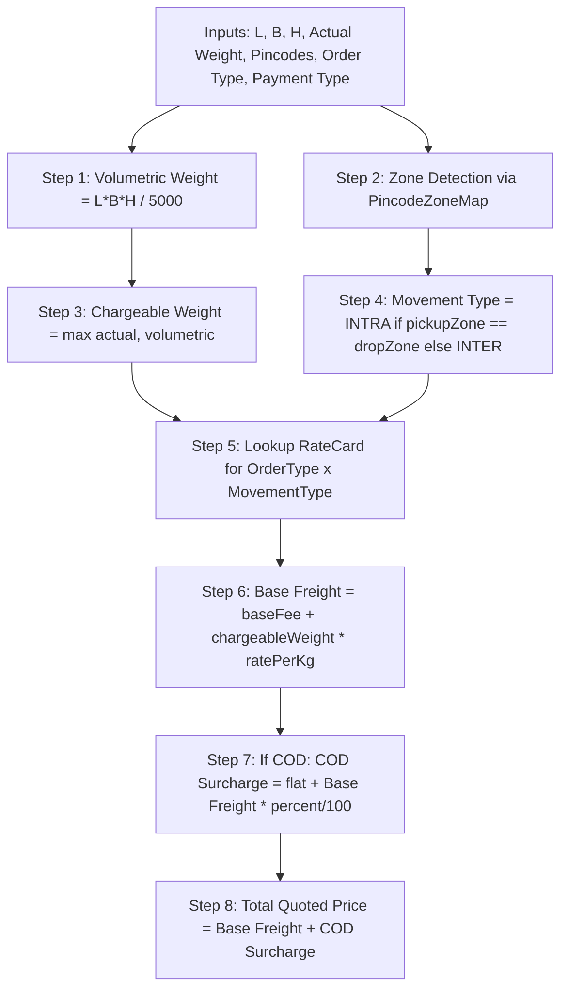
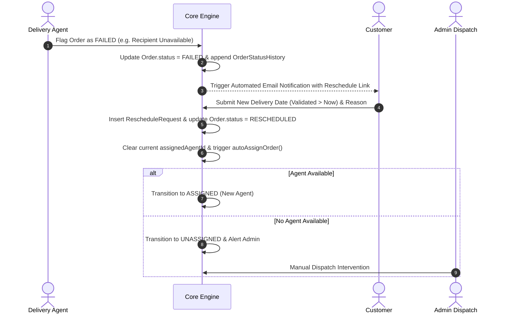

# Business Rules & Domain Logic: Last-Mile Delivery Tracker

## 1. Dynamic Pricing & Rate Calculation Engine

The rate calculation engine is implemented as pure, isolated mathematical functions (`rateEngine.ts`) that compute exact shipping charges based entirely on database-driven rate cards without hardcoded pricing values.

### 1.1 Mathematical Formulas & Step-by-Step Pipeline



#### Step 1: Volumetric Weight Calculation
Volumetric weight reflects the density of a package. Dimensional space is converted to billable weight using the international logistics divisor of `5000`:
$$\text{Volumetric Weight (kg)} = \frac{\text{Length (cm)} \times \text{Breadth (cm)} \times \text{Height (cm)}}{5000}$$

#### Step 2: Chargeable Weight Resolution
The carrier charges on whichever metric is greater to protect against bulky, light packages:
$$\text{Chargeable Weight (kg)} = \max(\text{Actual Weight}, \text{Volumetric Weight})$$

#### Step 3: Zone Detection & Movement Classification
Origin and destination pincodes are resolved against `PincodeZoneMap`:
- If $\text{pickupZoneId} == \text{dropZoneId} \implies \mathbf{INTRA}$ (Intra-Zone)
- If $\text{pickupZoneId} \neq \text{dropZoneId} \implies \mathbf{INTER}$ (Inter-Zone)

#### Step 4: Rate Card Lookup
The system fetches the active `RateCard` matching:
$$\text{Order Type } (\text{B2B} \mid \text{B2C}) \times \text{Zone Type } (\text{INTRA} \mid \text{INTER})$$
*Note: If a specific zone-pair card exists (`fromZoneId` and `toZoneId`), it takes priority over the generic intra/inter card.*

#### Step 5: Base Freight Computation
$$\text{Base Freight} = \text{baseFee} + (\text{Chargeable Weight} \times \text{ratePerKg})$$

#### Step 6: COD Surcharge Application
Cash-on-Delivery incurs handling fees and return-to-origin risk. If payment type is `COD`, the configured `CodConfig` for the order type is applied:
$$\text{COD Surcharge} = \text{surchargeFlat} + \left(\text{Base Freight} \times \frac{\text{surchargePercent}}{100}\right)$$
If payment type is `PREPAID`, $\text{COD Surcharge} = 0.00$.

#### Step 7: Final Charge Total
$$\text{Total Price} = \text{Base Freight} + \text{COD Surcharge}$$

---

### 1.2 End-to-End Worked Example

- **Package Parameters**: $20\text{ cm} \times 15\text{ cm} \times 10\text{ cm}$, Actual Weight = $0.4\text{ kg}$.
- **Shipment Category**: B2C, Payment Type = `COD`.
- **Routing**: Pickup Pincode `110001` (North Zone), Drop Pincode `110021` (North Zone).
- **Admin Configuration in DB**:
  - `RateCard (B2C, INTRA)`: `baseFee = 50.00`, `ratePerKg = 20.00`
  - `CodConfig (B2C)`: `surchargeFlat = 10.00`, `surchargePercent = 5%`

| Calculation Stage | Mathematical Evaluation | Result |
|---|---|---|
| 1. Volumetric Weight | $(20 \times 15 \times 10) / 5000$ | **$0.600\text{ kg}$** |
| 2. Chargeable Weight | $\max(0.400, 0.600)$ | **$0.600\text{ kg}$** *(Volumetric wins)* |
| 3. Zone Match | Both in North Zone | **`INTRA`** |
| 4. Weight Freight | $0.600 \times 20.00$ | **$12.00$** |
| 5. Base Freight | $50.00 + 12.00$ | **$62.00$** |
| 6. COD Surcharge | $10.00 + (62.00 \times 0.05)$ | **$13.10$** |
| **7. Final Quoted Total** | $62.00 + 13.10$ | **$\mathbf{75.10}$** |

---

## 2. Zone Detection Architecture

### 2.1 Pincode-to-Zone Relational Mapping
- **Mechanism**: Administrative zones (e.g., North, South, Central) contain multiple physical postal codes mapped in the `PincodeZoneMap` table.
- **Complexity**: $O(1)$ indexed database query (`SELECT zone_id FROM pincode_zone_maps WHERE pincode = ?`).
- **Error Handling**: If a customer inputs a pincode that is unmapped, the rate engine rejects the quote with:
  `"Pickup/Drop pincode is not mapped to any operational zone. Admin must configure it."`
  No guessed zones or false fallbacks are permitted.

### 2.2 Comparison with Alternative Approaches

| Strategy | Implementation Complexity | Cost | Precision & Edge Handling | Selected? |
|---|---|---|---|:---:|
| **1. Postal Code Mapping** | **Very Low** | **$0 (Self-contained)** | Discrete, exact administrative mapping | **✅ YES (Chosen)** |
| **2. PostGIS Polygons** | High | Paid Geocoding APIs | Continuous boundary precision | ❌ No |
| **3. Radial Hub Distance** | Moderate | Paid Geocoding APIs | Inaccurate along non-circular borders | ❌ No |

---

## 3. Nearest Available Agent Auto-Assignment Heuristics

### 3.1 Candidate Selection Rules
An agent is eligible for dispatch if and only if all four conditions are satisfied:
1. `User.role === 'AGENT'`.
2. `AgentProfile.isAvailable === true` (agent is on-duty).
3. `AgentProfile.currentZoneId === Order.pickupZoneId` (agent is in the pickup area).
4. `Active Orders Count < AgentProfile.maxActiveOrders` (agent is not saturated).

*Active orders are defined as orders currently in: `ASSIGNED`, `PICKED_UP`, `IN_TRANSIT`, or `OUT_FOR_DELIVERY`.*

### 3.2 Tie-Breaking Heuristics
If multiple eligible agents are found in the pickup zone:
1. **Primary**: Agent with the **fewest active orders** (load-balancing across the fleet).
2. **Secondary**: Agent with the highest remaining capacity headroom ($\text{maxActiveOrders} - \text{activeOrders}$).
3. **Tertiary**: Alphabetical/deterministic ID fallback.

### 3.3 Concurrency Guard & Atomic Assignment
- **Race Condition Prevention**: When multiple concurrent orders are placed or auto-assigned in the same zone, the auto-assignment logic executes within an atomic database transaction (`prisma.$transaction`). This serializes active capacity evaluation and prevents two parallel requests from over-allocating an agent past `maxActiveOrders`.
- **Zero-Agent Fallback**: If no agent satisfies the criteria, the order transitions to `UNASSIGNED`. It is flagged with an active alert in the admin dashboard. The order is **never silently stuck or abandoned**.

---

## 4. Order Status State Machine & Guard Invariants

```text
[ DRAFT / QUOTED ] ──► [ CREATED / UNASSIGNED ] ──► [ ASSIGNED ]
                                                         │
                                                         ▼
                                                    [ PICKED_UP ]
                                                         │
                                                         ▼
                                                    [ IN_TRANSIT ]
                                                         │
                                                         ▼
                                               [ OUT_FOR_DELIVERY ]
                                                  │            │
                                          (Success)            (Failure)
                                                  ▼            ▼
                                            [ DELIVERED ]   [ FAILED ]
                                            (Terminal)         │
                                                               ▼ (Customer reschedules)
                                                        [ RESCHEDULED ]
                                                               │
                                                               ▼ (Re-triggers assignment)
                                                            [ ASSIGNED ]
```

### 4.1 Transition Validation Matrix

| Current State | Target State | Permitted Actor | Side Effects & Validations |
|---|---|---|---|
| `DRAFT` | `CREATED` | `CUSTOMER`, `ADMIN` | Persist order snapshot with locked pricing. |
| `CREATED` | `UNASSIGNED` | `SYSTEM`, `ADMIN` | Triggered if auto-assign finds 0 eligible agents. |
| `CREATED` / `UNASSIGNED` | `ASSIGNED` | `SYSTEM`, `ADMIN` | Set `assignedAgentId`, append history log. |
| `ASSIGNED` | `PICKED_UP` | `AGENT`, `ADMIN` | Agent collects package from sender. Send notification. |
| `PICKED_UP` | `IN_TRANSIT` | `AGENT`, `ADMIN` | Package is moving between hubs/vehicles. Send notification. |
| `IN_TRANSIT` | `OUT_FOR_DELIVERY` | `AGENT`, `ADMIN` | Final mile run initiated. Send notification. |
| `OUT_FOR_DELIVERY` | `DELIVERED` | `AGENT`, `ADMIN` | Package handed over. Mark as terminal state. |
| `OUT_FOR_DELIVERY` | `FAILED` | `AGENT`, `ADMIN` | Delivery attempt unsuccessful. Send failure notification. |
| `FAILED` | `RESCHEDULED` | `CUSTOMER`, `ADMIN` | Customer picks new date. Resets assignment and re-triggers dispatch. |

### 4.2 State Machine Invariants
1. **Terminal State Immutability**: Once an order reaches `DELIVERED`, no further transitions are allowed.
2. **Reschedule Prerequisite**: An order can **only** transition to `RESCHEDULED` from `FAILED`. Direct transitions from `OUT_FOR_DELIVERY` to `RESCHEDULED` are blocked.
3. **Audit Log Invariant**: Every state change atomically creates an append-only row in `OrderStatusHistory` recording `orderId`, `status`, `changedByUserId`, `note`, and `createdAt`.
4. **Admin Override Rule**: Admins can override any non-terminal state, but the audit trail explicitly tags the entry as `actorRole: ADMIN` with a mandatory reason note.

---

## 5. Failed Delivery & Reschedule Flow

### 5.1 Reschedule Date Temporal Validation
- **Future Date Requirement**: When rescheduling, the `newDate` must strictly be in the future (`newDate > now()`). Historical dates or invalid timestamps are rejected at the DTO validation layer.

### 5.2 Flow Sequence



---

## 6. Notification Rules & Asynchronous Decoupling

- **Trigger Points**: Triggered on `CREATED`, `PICKED_UP`, `IN_TRANSIT`, `OUT_FOR_DELIVERY`, `DELIVERED`, `FAILED`, and `RESCHEDULED`.
- **Decoupled Execution**: All email dispatches execute asynchronously via `NotificationService`. If an external SMTP server fails or times out, the primary database state transition remains committed, and the error is logged to `NotificationLog.status = 'FAILED'`.
