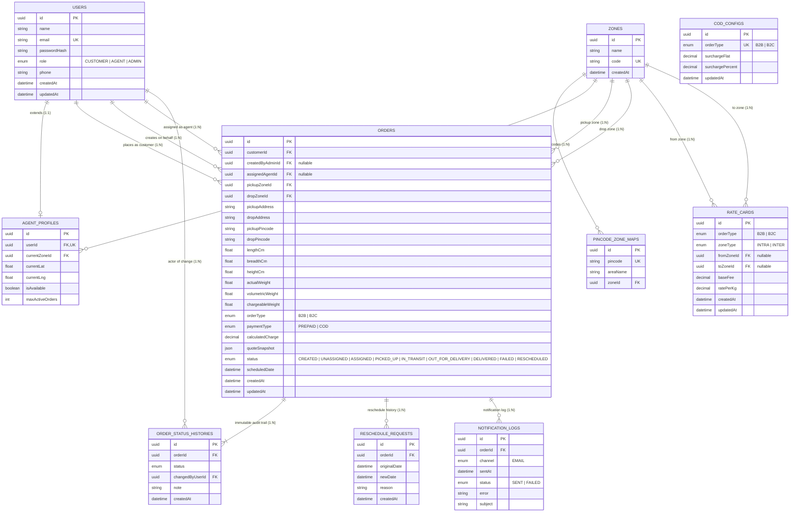

# Database Design & Schema Specification: Last-Mile Delivery Tracker

## 1. Database Philosophy & Technology Choice

The **Last-Mile Delivery Tracker** uses **PostgreSQL 16** managed via **Prisma ORM**. 

### 1.1 Why PostgreSQL Over Document/NoSQL Databases?
1. **Relational Constraints**: Routing involves multi-entity relationships (`Zone` $\leftrightarrow$ `PincodeZoneMap`, `Zone` $\leftrightarrow$ `Order` as origin and destination, `User` $\leftrightarrow$ `Order` across multiple roles). Relational FKs prevent orphaned shipments or broken zone lookups.
2. **Pricing Integrity**: Rate cards require structured composite uniqueness on `(orderType, zoneType)` or specific zone pairs.
3. **Immutable Audit Trails**: Append-only transition logs require strict relational consistency tied to the parent order and the acting user.
4. **ACID Transactions**: Atomic creation of orders, status logs, and reschedule cycles ensures data consistency during high-concurrency dispatch.

---

## 2. Visual Entity-Relationship (ER) Diagram



---

## 3. Table-by-Table Technical Breakdown

### 3.1 `users`
- **Purpose**: Identity store for all personas (Customer, Delivery Agent, Admin).
- **Columns**:
  - `id` (UUID, PK): Unique user identifier.
  - `name` (String): Full name of the user.
  - `email` (String, UK): Case-insensitive unique login identifier.
  - `passwordHash` (String): `bcryptjs` hashed credentials.
  - `role` (Enum): `CUSTOMER`, `AGENT`, or `ADMIN`.
  - `phone` (String, Optional): Contact number.
  - `createdAt`, `updatedAt` (DateTime).

### 3.2 `agent_profiles`
- **Purpose**: Extends `users` for delivery personnel with telemetry and capacity parameters.
- **Columns**:
  - `id` (UUID, PK)
  - `userId` (UUID, FK $\rightarrow$ `users.id`, UK, `ON DELETE CASCADE`): 1:1 binding to parent user.
  - `currentZoneId` (UUID, FK $\rightarrow$ `zones.id`): Operating zone for assignment eligibility.
  - `currentLat`, `currentLng` (Float, Optional): Live telemetry coordinates.
  - `isAvailable` (Boolean, Default `true`): Duty toggle for auto-assignment filtering.
  - `maxActiveOrders` (Int, Default `5`): Maximum concurrent active order threshold.

### 3.3 `zones`
- **Purpose**: Administrative delivery boundaries for pricing and dispatch.
- **Columns**:
  - `id` (UUID, PK)
  - `name` (String): Descriptive zone name (e.g., "North Zone", "Metro East").
  - `code` (String, UK): Short unique identifier (e.g., "NORTH", "SOUTH").
  - `createdAt` (DateTime).

### 3.4 `pincode_zone_maps`
- **Purpose**: Deterministic mapping of postal codes to zones.
- **Columns**:
  - `id` (UUID, PK)
  - `pincode` (String, UK): Postal code (natural key).
  - `areaName` (String, Optional): Locality name (e.g., "Connaught Place").
  - `zoneId` (UUID, FK $\rightarrow$ `zones.id`, `ON DELETE CASCADE`).

### 3.5 `rate_cards`
- **Purpose**: Dynamic freight pricing rules without hardcoded values.
- **Columns**:
  - `id` (UUID, PK)
  - `orderType` (Enum: `B2B`, `B2C`)
  - `zoneType` (Enum: `INTRA`, `INTER`)
  - `fromZoneId`, `toZoneId` (UUID, Optional FKs $\rightarrow$ `zones.id`): For custom zone-pair overrides.
  - `baseFee` (Decimal 10,2): Starting base charge.
  - `ratePerKg` (Decimal 10,2): Incremental charge per chargeable kilogram.
  - `createdAt`, `updatedAt` (DateTime).
  - **Index**: `@@index([orderType, zoneType])`.

### 3.6 `cod_configs`
- **Purpose**: Configurable Cash-on-Delivery handling surcharges.
- **Columns**:
  - `id` (UUID, PK)
  - `orderType` (Enum, UK: `B2B`, `B2C`): Unique rule per customer segment.
  - `surchargeFlat` (Decimal 10,2, Default `0`): Fixed surcharge fee.
  - `surchargePercent` (Decimal 10,2, Default `0`): Percentage surcharge on base freight.
  - `updatedAt` (DateTime).

### 3.7 `orders`
- **Purpose**: Central transactional order entity storing package metrics, routing, price snapshots, and current status.
- **Columns**:
  - `id` (UUID, PK)
  - `customerId` (UUID, FK $\rightarrow$ `users.id`): Order owner.
  - `createdByAdminId` (UUID, Optional FK $\rightarrow$ `users.id`): Present if booked by an admin.
  - `assignedAgentId` (UUID, Optional FK $\rightarrow$ `users.id`): Currently assigned courier.
  - `pickupAddress`, `dropAddress` (String)
  - `pickupPincode`, `dropPincode` (String)
  - `pickupZoneId`, `dropZoneId` (UUID, FKs $\rightarrow$ `zones.id`)
  - `lengthCm`, `breadthCm`, `heightCm` (Float)
  - `actualWeight`, `volumetricWeight`, `chargeableWeight` (Float)
  - `orderType` (Enum: `B2B`, `B2C`), `paymentType` (Enum: `PREPAID`, `COD`)
  - `calculatedCharge` (Decimal 10,2)
  - `quoteSnapshot` (JSON): Complete itemized calculation breakdown.
  - `status` (Enum: `CREATED`, `UNASSIGNED`, `ASSIGNED`, `PICKED_UP`, `IN_TRANSIT`, `OUT_FOR_DELIVERY`, `DELIVERED`, `FAILED`, `RESCHEDULED`).
  - `scheduledDate` (DateTime)
  - `createdAt`, `updatedAt` (DateTime).
  - **Indices**: `@@index([status])`, `@@index([customerId])`, `@@index([assignedAgentId])`.

### 3.8 `order_status_histories`
- **Purpose**: Strictly append-only immutable audit trail.
- **Columns**:
  - `id` (UUID, PK)
  - `orderId` (UUID, FK $\rightarrow$ `orders.id`, `ON DELETE RESTRICT`)
  - `status` (Enum: `OrderStatus`)
  - `changedByUserId` (UUID, FK $\rightarrow$ `users.id`)
  - `note` (String, Optional): Reason, failure note, or reschedule context.
  - `createdAt` (DateTime, Default `now()`).
  - **Index**: `@@index([orderId, createdAt])`.

### 3.9 `reschedule_requests`
- **Purpose**: Captures failed delivery retry dates and customer reasons.
- **Columns**:
  - `id` (UUID, PK)
  - `orderId` (UUID, FK $\rightarrow$ `orders.id`)
  - `originalDate` (DateTime), `newDate` (DateTime)
  - `reason` (String)
  - `createdAt` (DateTime).

### 3.10 `notification_logs`
- **Purpose**: Audit record of outbound customer communications.
- **Columns**:
  - `id` (UUID, PK)
  - `orderId` (UUID, FK $\rightarrow$ `orders.id`)
  - `channel` (Enum: `EMAIL`, Default `EMAIL`)
  - `sentAt` (DateTime, Default `now()`)
  - `status` (Enum: `SENT`, `FAILED`)
  - `error` (String, Optional), `subject` (String, Optional).

---

## 4. Why `Order.status` and `OrderStatusHistory` are Separate

- **`Order.status` (Operational Cache)**: Enables fast $O(1)$ indexed reads for customer order lists, agent active queues, and admin dashboard filters without expensive aggregation queries (`MAX(timestamp)`).
- **`OrderStatusHistory` (Immutable Single Source of Truth)**: Strictly append-only table. It preserves every transition, the actor responsible, timestamps, and notes. When an order fails and is rescheduled, previous failed attempts are never overwritten.

---

## 5. Complete Prisma Schema Code

```prisma
generator client {
  provider = "prisma-client-js"
}

datasource db {
  provider = "postgresql"
  url      = env("DATABASE_URL")
}

enum Role {
  CUSTOMER
  AGENT
  ADMIN
}

enum OrderType {
  B2B
  B2C
}

enum ZoneType {
  INTRA
  INTER
}

enum PaymentType {
  PREPAID
  COD
}

enum OrderStatus {
  CREATED
  UNASSIGNED
  ASSIGNED
  PICKED_UP
  IN_TRANSIT
  OUT_FOR_DELIVERY
  DELIVERED
  FAILED
  RESCHEDULED
}

enum NotificationChannel {
  EMAIL
}

enum NotificationStatus {
  SENT
  FAILED
}

model User {
  id           String   @id @default(uuid())
  name         String
  email        String   @unique
  passwordHash String
  role         Role
  phone        String?
  createdAt    DateTime @default(now())
  updatedAt    DateTime @updatedAt

  agentProfile       AgentProfile?
  customerOrders     Order[]              @relation("CustomerOrders")
  adminCreatedOrders Order[]              @relation("AdminCreatedOrders")
  assignedOrders     Order[]              @relation("AssignedAgent")
  statusChanges      OrderStatusHistory[]

  @@map("users")
}

model AgentProfile {
  id              String   @id @default(uuid())
  userId          String   @unique
  user            User     @relation(fields: [userId], references: [id], onDelete: Cascade)
  currentZoneId   String?
  currentZone     Zone?    @relation(fields: [currentZoneId], references: [id])
  currentLat      Float?
  currentLng      Float?
  isAvailable     Boolean  @default(true)
  maxActiveOrders Int      @default(5)

  @@map("agent_profiles")
}

model Zone {
  id        String   @id @default(uuid())
  name      String
  code      String   @unique
  createdAt DateTime @default(now())

  pincodes      PincodeZoneMap[]
  agents        AgentProfile[]
  pickupOrders  Order[]          @relation("PickupZone")
  dropOrders    Order[]          @relation("DropZone")
  rateCardsFrom RateCard[]       @relation("RateFromZone")
  rateCardsTo   RateCard[]       @relation("RateToZone")

  @@map("zones")
}

model PincodeZoneMap {
  id       String  @id @default(uuid())
  pincode  String  @unique
  areaName String?
  zoneId   String
  zone     Zone    @relation(fields: [zoneId], references: [id], onDelete: Cascade)

  @@map("pincode_zone_maps")
}

model RateCard {
  id         String    @id @default(uuid())
  orderType  OrderType
  zoneType   ZoneType
  fromZoneId String?
  fromZone   Zone?     @relation("RateFromZone", fields: [fromZoneId], references: [id])
  toZoneId   String?
  toZone     Zone?     @relation("RateToZone", fields: [toZoneId], references: [id])
  baseFee    Decimal   @db.Decimal(10, 2)
  ratePerKg  Decimal   @db.Decimal(10, 2)
  createdAt  DateTime  @default(now())
  updatedAt  DateTime  @updatedAt

  @@index([orderType, zoneType])
  @@map("rate_cards")
}

model CodConfig {
  id               String    @id @default(uuid())
  orderType        OrderType @unique
  surchargeFlat    Decimal   @db.Decimal(10, 2) @default(0)
  surchargePercent Decimal   @db.Decimal(10, 2) @default(0)
  updatedAt        DateTime  @updatedAt

  @@map("cod_configs")
}

model Order {
  id               String      @id @default(uuid())
  customerId       String
  customer         User        @relation("CustomerOrders", fields: [customerId], references: [id])
  createdByAdminId String?
  createdByAdmin   User?       @relation("AdminCreatedOrders", fields: [createdByAdminId], references: [id])
  pickupAddress    String
  dropAddress      String
  pickupPincode    String
  dropPincode      String
  pickupZoneId     String
  pickupZone       Zone        @relation("PickupZone", fields: [pickupZoneId], references: [id])
  dropZoneId       String
  dropZone         Zone        @relation("DropZone", fields: [dropZoneId], references: [id])
  lengthCm         Float
  breadthCm        Float
  heightCm         Float
  actualWeight     Float
  volumetricWeight Float
  chargeableWeight Float
  orderType        OrderType
  paymentType      PaymentType
  calculatedCharge Decimal     @db.Decimal(10, 2)
  quoteSnapshot    Json
  status           OrderStatus @default(CREATED)
  assignedAgentId  String?
  assignedAgent    User?       @relation("AssignedAgent", fields: [assignedAgentId], references: [id])
  scheduledDate    DateTime
  createdAt        DateTime    @default(now())
  updatedAt        DateTime    @updatedAt

  statusHistory    OrderStatusHistory[]
  reschedules      RescheduleRequest[]
  notifications    NotificationLog[]

  @@index([status])
  @@index([customerId])
  @@index([assignedAgentId])
  @@map("orders")
}

model OrderStatusHistory {
  id              String      @id @default(uuid())
  orderId         String
  order           Order       @relation(fields: [orderId], references: [id], onDelete: Restrict)
  status          OrderStatus
  changedByUserId String
  changedBy       User        @relation(fields: [changedByUserId], references: [id])
  note            String?
  createdAt       DateTime    @default(now())

  @@index([orderId, createdAt])
  @@map("order_status_histories")
}

model RescheduleRequest {
  id           String   @id @default(uuid())
  orderId      String
  order        Order    @relation(fields: [orderId], references: [id])
  originalDate DateTime
  newDate      DateTime
  reason       String
  createdAt    DateTime @default(now())

  @@map("reschedule_requests")
}

model NotificationLog {
  id      String              @id @default(uuid())
  orderId String
  order   Order               @relation(fields: [orderId], references: [id])
  channel NotificationChannel @default(EMAIL)
  sentAt  DateTime            @default(now())
  status  NotificationStatus
  error   String?
  subject String?

  @@map("notification_logs")
}
```

---

## 6. Default Seed Data Specification

The database seed (`backend/prisma/seed.ts`) populates initial records for instant validation:

1. **Zones**:
   - `NORTH` (North Zone)
   - `SOUTH` (South Zone)
   - `CENTRAL` (Central Zone)
2. **Pincodes**:
   - `110001` (Connaught Place $\rightarrow$ NORTH), `110021` (Chanakyapuri $\rightarrow$ NORTH)
   - `560001` (Bengaluru GPO $\rightarrow$ SOUTH), `560034` (Koramangala $\rightarrow$ SOUTH)
   - `400001` (Fort Mumbai $\rightarrow$ CENTRAL), `400050` (Bandra $\rightarrow$ CENTRAL)
3. **Rate Cards**:
   - `B2C INTRA`: Base Fee ₹50, Rate ₹20/kg
   - `B2C INTER`: Base Fee ₹80, Rate ₹35/kg
   - `B2B INTRA`: Base Fee ₹40, Rate ₹15/kg
   - `B2B INTER`: Base Fee ₹70, Rate ₹28/kg
4. **COD Configurations**:
   - `B2C`: Flat ₹10, Surcharge 5%
   - `B2B`: Flat ₹20, Surcharge 2%
5. **Users**:
   - Admin: `admin@lastmile.com`
   - Customer: `customer@lastmile.com`
   - Agent North: `agent.north@lastmile.com` (Zone: NORTH, maxActive: 5)
   - Agent South: `agent.south@lastmile.com` (Zone: SOUTH, maxActive: 3)
   - *Default Password for all seeded users*: `password123`
