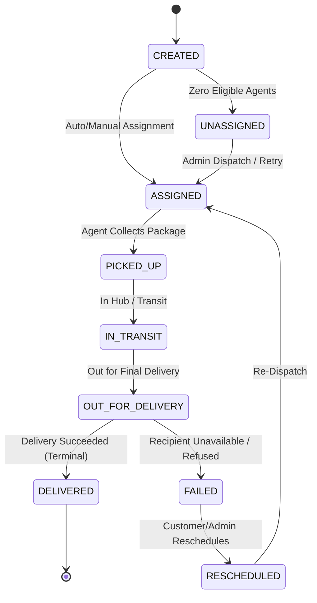

# System Design Document: Last-Mile Delivery Tracker

A comprehensive architectural and engineering blueprint for the full-stack, multi-tenant logistics management platform.

---

## 1. High-Level Architecture Overview

The **Last-Mile Delivery Tracker** employs a decoupled 3-Tier architecture designed for high throughput, transactional consistency, and strict multi-tenant data isolation.

```
+-------------------------------------------------------------------------+
|                              PRESENTATION LAYER                         |
|  React 18 + Vite SPA  |  TailwindCSS  |  Role-Based Portals (Cust/Agent/Admin)
+------------------------------------+------------------------------------+
                                     |  HTTPS / REST (JWT Bearer Auth)
                                     v
+-------------------------------------------------------------------------+
|                               API GATEWAY LAYER                         |
|  Express 5 (TypeScript) | Zod DTO Validation | Centralized RBAC Guards  |
+------------------------------------+------------------------------------+
                                     |
               +---------------------+---------------------+
               |                     |                     |
               v                     v                     v
+-----------------------+ +-----------------------+ +---------------------+
|   RATE ENGINE SERVICE | |  ASSIGNMENT SERVICE   | | ORDER STATUS SERVICE|
| Volumetric & Freight  | | Capacity Load-Balance | | State Machine Audit |
+-----------------------+ +-----------------------+ +---------------------+
               |                     |                     |
               +---------------------+---------------------+
                                     |
                                     v
+-------------------------------------------------------------------------+
|                              PERSISTENCE LAYER                          |
|  PostgreSQL 16 Engine | Prisma ORM Singleton | Append-Only Audit Logs   |
+-------------------------------------------------------------------------+
```

### Core Tenets:
1. **Layer Decoupling & Thin Controllers**: Express route handlers strictly validate incoming payloads via Zod DTO schemas and delegate all business logic to pure domain services.
2. **Zero Hardcoded Parameters**: Geographic zones, postal code mappings, rate cards, and COD surcharge rules are 100% database-driven.
3. **Audit Trail Immutability**: State transitions write append-only audit entries to `OrderStatusHistory`—history records are never mutated or deleted.
4. **Side-Effect Fault Isolation**: External I/O (email notifications) is executed asynchronously, ensuring third-party latencies or outages never abort database transactions.

---

## 2. Multi-Tenant Identity, RBAC & Security

### 2.1 Identity Store & Password Security
* **Authentication**: Stateless JSON Web Tokens (JWT) signed with HMAC-SHA256 containing `{ id, email, role, currentZoneId }`.
* **Password Hashing**: Salted hashing via `bcryptjs` with $\ge 10$ salt rounds. Plaintext credentials are never persisted.
* **Input Normalization**: Gateway sanitization forces email normalization (`.toLowerCase().trim()`) and postal code uppercase formatting (`.trim().toUpperCase()`).

### 2.2 Role-Based Access Control (RBAC) & IDOR Protection
* **Roles**:
  * `CUSTOMER`: Can request quotes, book shipments, track self-owned packages, and reschedule failed deliveries.
  * `AGENT`: Can toggle availability, view assigned shipments, and advance package status through the delivery lifecycle.
  * `ADMIN`: Full operational visibility, unassigned queue monitoring, manual courier override, and dynamic configuration of zones, rates, and COD surcharges.
* **Resource Ownership Protection (`canAccessOrder`)**: Prevents Insecure Direct Object References (IDOR). Customers can only access orders where `order.customerId === req.user.id`; agents can only access shipments where `order.assignedAgentId === req.user.id`.

---

## 3. Pure Mathematical Rate Calculation Engine

Pricing is calculated dynamically using a pure, deterministic algorithm isolated from database and HTTP layers.

### 3.1 Mathematical Formulation
1. **Volumetric Weight ($W_v$)**:
   $$W_v = \frac{\text{Length (cm)} \times \text{Breadth (cm)} \times \text{Height (cm)}}{5000}$$
2. **Chargeable Weight ($W_c$)**:
   $$W_c = \max(\text{Actual Weight (kg)}, W_v)$$
3. **Movement Type Resolution**:
   $$\text{Zone Type} = \begin{cases} \text{INTRA} & \text{if } \text{pickupZoneId} = \text{dropZoneId} \\ \text{INTER} & \text{if } \text{pickupZoneId} \ne \text{dropZoneId} \end{cases}$$
4. **Tariff Resolution Hierarchy**:
   * **Rule 1 (Specific Pair Override)**: Rate card matching `orderType` + exact `fromZoneId` $\rightarrow$ `toZoneId`.
   * **Rule 2 (Generic Zone Fallback)**: Rate card matching `orderType` + `zoneType` (`INTRA` or `INTER`).
5. **Base Freight Calculation**:
   $$\text{Subtotal} = \text{baseFee} + (W_c \times \text{ratePerKg})$$
6. **Cash on Delivery (COD) Surcharge**:
   $$\text{COD Surcharge} = \begin{cases} \text{surchargeFlat} + \left(\text{Subtotal} \times \frac{\text{surchargePercent}}{100}\right) & \text{if } \text{paymentType} = \text{COD} \\ 0.00 & \text{if } \text{paymentType} = \text{PREPAID} \end{cases}$$
7. **Grand Total**:
   $$\text{Total Charge} = \text{Subtotal} + \text{COD Surcharge}$$

### 3.2 Quote-First Immutability
Before an order is created, `POST /api/orders/quote` computes and displays the itemized breakdown. When the customer confirms, the final breakdown is permanently frozen in `calculatedCharge` and `quoteSnapshot` JSON columns, guaranteeing pricing stability against future tariff updates.

---

## 4. Dynamic Agent Assignment & Capacity Load-Balancing

The assignment engine optimizes fleet utilization while preventing courier burnout.

```
                     +---------------------------+
                     |    New Order Created /    |
                     |    Reschedule Triggered   |
                     +-------------+-------------+
                                   |
                                   v
                     +---------------------------+
                     | Query Available Agents in |
                     |     Order's PickupZone    |
                     +-------------+-------------+
                                   |
                                   v
                     +---------------------------+
                     | Calculate Active Load:    |
                     | Count orders in:          |
                     | [ASSIGNED, PICKED_UP,     |
                     |  IN_TRANSIT, OUT_FOR_DEL] |
                     +-------------+-------------+
                                   |
                                   v
                     +---------------------------+
                     | Filter Agents with:       |
                     | active < maxActiveOrders  |
                     +-------------+-------------+
                                   |
                  +----------------+----------------+
                  |                                 |
         [Eligible Agents > 0]             [Eligible Agents == 0]
                  |                                 |
                  v                                 v
     +--------------------------+     +--------------------------+
     | Pick Agent with Fewest   |     | Transition to            |
     | Active Orders (Greedy)   |     | UNASSIGNED Status        |
     +------------+-------------+     +-------------+------------+
                  |                                 |
                  v                                 v
     +--------------------------+     +--------------------------+
     | Transition to ASSIGNED   |     | Increment Admin Alert    |
     | Append StatusHistory Log |     | Badge for Manual Action  |
     +--------------------------+     +--------------------------+
```

---

## 5. Order State Machine & Immutable History Audit

The platform strictly enforces valid operational workflows and maintains an append-only audit trail.



### State Invariants:
1. **Linear Transitions**: Couriers cannot skip phases (e.g. `ASSIGNED` $\rightarrow$ `DELIVERED` is strictly rejected).
2. **Terminal Immutability**: `DELIVERED` is an immutable terminal state. No subsequent modifications are permitted by any actor.
3. **Append-Only History**: Every transition creates a row in `OrderStatusHistory` recording `changedByUserId`, timestamp, and transition notes.

---

## 6. Automated Failure Recovery & Reschedule Subsystem

When a delivery attempt fails (`status = FAILED`):
1. **Customer Self-Service**: The customer accesses the reschedule interface (`POST /api/orders/:id/reschedule`).
2. **Temporal Validation**: The new delivery timestamp must be strictly in the future (`newDate > now()`).
3. **Audit Tracking**: A record is persisted in `RescheduleRequest` storing `originalDate`, `newDate`, and `reason`.
4. **State Transition & Re-Dispatch**: The order moves to `RESCHEDULED`, preserving historical attempt logs, and automatically triggers the assignment engine to allocate a courier for the new date.

---

## 7. Decoupled Notification Subsystem

Outbound notifications (email) are triggered as side-effects of state transitions:
1. **Decoupled Asynchrony**: Notifications are dispatched outside the primary database write path.
2. **Fault Isolation**: External SMTP gateway timeouts or authentication errors are caught and recorded to `NotificationLog.status = 'FAILED'`. Database transactions remain committed.

---

## 8. High-Scale Evolution & Production Architecture

To scale from tens of thousands to millions of daily deliveries:
1. **Database Read Replicas**: Route customer tracking lookups and dashboard read queries to PostgreSQL read replicas using connection pooling (e.g. PgBouncer / Prisma Accelerate).
2. **Redis In-Memory Caching**: Cache postal-code-to-zone mappings (`PincodeZoneMap`) and active rate cards in Redis with cache invalidation on admin mutation.
3. **Asynchronous Message Queue (BullMQ / RabbitMQ)**: Offload high-volume auto-dispatch calculations and email dispatches to background worker clusters.
4. **Spatial GIS Indexing**: Upgrade flat administrative zones to PostGIS geographic polygon boundary matching ($O(\log N)$ containment queries).
