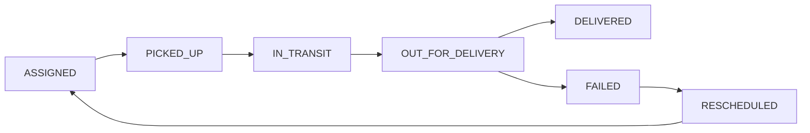

# Test Plan & Quality Assurance: Last-Mile Delivery Tracker

## 1. Testing Strategy & Philosophy

The testing framework guarantees **correctness, reliability, and security** across all core engines:

```text
       ┌───────────────────────────────┐
       │     End-to-End & UI Tests     │  (Role Portals, Timeline Flow)
       ├───────────────────────────────┤
       │       Integration Tests       │  (REST API, Auth & RBAC Guards)
       ├───────────────────────────────┤
       │       Unit Tests (Vitest)     │  (Pure Rate Engine, State Machine)
       └───────────────────────────────┘
```

- **Unit Tests (Vitest)**: Focus on the pure mathematical functions of the rate engine and the state machine transition logic. Fast execution ($< 1\text{s}$) with zero network dependencies.
- **Integration Tests**: Verify database integrity, transaction atomicity, foreign key cascades, and RBAC ownership guards.
- **Manual / E2E Verification**: Validate the end-to-end journey from pre-order quote to customer reschedule in the React SPA.

---

## 2. Rate Engine Unit Test Matrix (`backend/src/services/rateEngine.test.ts`)

The pricing engine is verified across all dimensional, geographic, and financial combinations:

| Test ID | Test Scenario | Inputs | Expected Output | Assertion Rule |
|---|---|---|---|---|
| **TC-RE-01** | Volumetric Weight Calculation | $L=20, B=15, H=10$ | `0.6 kg` | `calculateVolumetricWeight(20, 15, 10) === 0.6` |
| **TC-RE-02** | Chargeable Weight (Volumetric Wins) | $\text{Actual}=0.4\text{ kg}, \text{Volumetric}=0.6\text{ kg}$ | `0.6 kg` | `getChargeableWeight(0.4, 0.6) === 0.6` |
| **TC-RE-03** | Chargeable Weight (Actual Wins) | $\text{Actual}=2.0\text{ kg}, \text{Volumetric}=0.6\text{ kg}$ | `2.0 kg` | `getChargeableWeight(2.0, 0.6) === 2.0` |
| **TC-RE-04** | Zone Type Detection (Intra vs Inter) | Same zone (`North` $\rightarrow$ `North`) vs Cross zone (`North` $\rightarrow$ `South`) | `INTRA` and `INTER` | `zoneTypeFor(north, north) === 'INTRA'`<br>`zoneTypeFor(north, south) === 'INTER'` |
| **TC-RE-05** | Rate Card Lookup by Order & Zone Type | B2C Intra, B2C Inter, B2B Intra | Respective Rate Card IDs | `lookupRate(cards, 'B2C', north, north).id === 'intra-b2c'` |
| **TC-RE-06** | Custom Zone-Pair Priority | Generic Inter vs Specific Zone-Pair card | Specific Zone-Pair Card | Specific card with matching `fromZoneId` & `toZoneId` takes precedence. |
| **TC-RE-07** | Prepaid COD Surcharge | PaymentType = `PREPAID` | `codSurcharge = 0.00` | Surcharge strictly 0 for non-COD shipments. |
| **TC-RE-08** | COD Surcharge Calculation | Subtotal = ₹62, Flat = ₹10, Percent = 5% | `codSurcharge = 13.10` | `10 + (62 * 0.05) === 13.10` |
| **TC-RE-09** | **Full Worked Example (B2C Intra COD)** | $20 \times 15 \times 10$, $0.4\text{ kg}$, B2C, COD, North $\rightarrow$ North | $\text{Total} = \mathbf{75.10}$ | Subtotal ₹62 + COD ₹13.10 = ₹75.10 |
| **TC-RE-10** | **Full Worked Example (B2C Inter Prepaid)** | $20 \times 15 \times 10$, $0.4\text{ kg}$, B2C, PREPAID, North $\rightarrow$ South | $\text{Total} = \mathbf{101.00}$ | Subtotal ₹101 + COD ₹0.00 = ₹101.00 |

---

## 3. Dynamic Assignment Engine Test Cases

| Test ID | Test Scenario | Condition | Expected Result |
|---|---|---|---|
| **TC-AS-01** | Pickup Zone Matching | 2 agents in North, 1 in South. Order in North. | Only North agents considered. |
| **TC-AS-02** | Capacity Saturation Guard | Agent has 5 active orders, `maxActiveOrders = 5`. | Agent is excluded from candidate pool. |
| **TC-AS-03** | Load Balancing Selection | Agent A has 1 active order; Agent B has 3 active orders. | Order auto-assigned to Agent A. |
| **TC-AS-04** | Zero Available Agents Fallback | All agents in zone offline or at max capacity. | Order transitions to `UNASSIGNED`; triggers admin alert. |

---

## 4. State Machine & Transition Invariant Tests



| Test ID | Test Scenario | Action | Expected Outcome |
|---|---|---|---|
| **TC-SM-01** | Valid Sequential Progression | `ASSIGNED` $\rightarrow$ `PICKED_UP` $\rightarrow$ `IN_TRANSIT` $\rightarrow$ `OUT_FOR_DELIVERY` $\rightarrow$ `DELIVERED` | Status updates successfully; each change logged in `OrderStatusHistory`. |
| **TC-SM-02** | Reject Illegal State Jump | Agent attempts `ASSIGNED` $\rightarrow$ `DELIVERED` | Rejected with `400 Bad Request: Invalid status jump`. |
| **TC-SM-03** | Terminal State Protection | Attempting to update a `DELIVERED` order | Rejected; `DELIVERED` is immutable. |
| **TC-SM-04** | Reschedule Prerequisite | Rescheduling an order that is in `IN_TRANSIT` | Rejected; only `FAILED` orders can be rescheduled. |
| **TC-SM-05** | Admin Override Logging | Admin overrides `IN_TRANSIT` $\rightarrow$ `FAILED` with note | Status updated; audit history records `actorRole = 'ADMIN'`. |

---

## 5. Security & RBAC Guard Verification

| Test ID | Test Scenario | Expected Outcome |
|---|---|---|
| **TC-SEC-01** | Customer Order Isolation (IDOR) | Customer A attempts to view `/api/orders/:id` belonging to Customer B $\rightarrow$ Returns `404 Not Found`. |
| **TC-SEC-02** | Agent Boundary Restriction | Agent attempts to update an order assigned to another agent $\rightarrow$ Returns `403 Forbidden`. |
| **TC-SEC-03** | Admin Route Protection | Customer attempts to `POST /api/rate-cards` $\rightarrow$ Returns `403 Forbidden`. |
| **TC-SEC-04** | Password Hashing Verification | Password in database must match `bcryptjs` hash pattern and never be stored in plain text. |

---

## 6. Test Execution & CI Automation

### Running Unit Tests Locally
```powershell
cd backend
npm run test
```

### Running Test Suite with Coverage
```powershell
cd backend
npx vitest run --coverage
```

### Automated CI Pipeline (`.github/workflows/test.yml`)
```yaml
name: Test Suite
on: [push, pull_request]
jobs:
  test:
    runs-on: ubuntu-latest
    steps:
      - uses: actions/checkout@v4
      - uses: actions/setup-node@v4
        with:
          node-version: 18
      - name: Install & Run Backend Tests
        run: |
          cd backend
          npm ci
          npm run test
```
